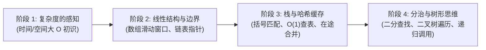

# 🔰 零算法基础编程学者进阶指南：从基础语法到算法入门

> **面向人群**：已掌握变量、循环、分支判断、函数与基础数组操作，但对数据结构（链表、栈、队列、树）和算法（双指针、二分、递归、动态规划）毫无概念的初学者。  
> **核心原则**：动画图解优先、逐行手搓实操、拒绝死记硬背、单测验证闭环。

---

## 🌟 权威顶级开源教程推荐（直通车）

经过对全球与中文开源生态的深度检索，针对“0 算法基础”最受认可的 4 套开箱即用现成开源教程推荐如下：

### 1. 《Hello 算法》 (krahets/hello-algo) - 130,000+ ⭐
* **项目地址**: [https://github.com/krahets/hello-algo](https://github.com/krahets/hello-algo)
* **在线阅读**: [https://www.hello-algo.com/](https://www.hello-algo.com/)
* **为什么适合零基础**：
  * **动画图解**：每一种数据结构与算法都有动态动画或精美矢量图解，不需要抽象脑补；
  * **多语言代码一键运行**：支持 JavaScript, Python, C++, Java, Go, Rust 等主流语言；
  * **从复杂度讲起**：第 2 章用生活案例通俗讲解大 O 表示法（时间/空间复杂度），专治“看不懂复杂度”的初学者；
  * **完全开源免费**：遵循知识共享许可协议。

---

### 2. 《代码随想录》 (youngyangyang04/leetcode-master) - 62,000+ ⭐
* **项目地址**: [https://github.com/youngyangyang04/leetcode-master](https://github.com/youngyangyang04/leetcode-master)
* **在线阅读**: [https://programmercarl.com/](https://programmercarl.com/)
* **为什么适合零基础**：
  * **保姆级循序渐进路线图**：严格按照「数组 -> 链表 -> 哈希表 -> 字符串 -> 栈与队列 -> 二叉树 -> 回溯 -> 贪心 -> 动态规划」顺序排布；
  * **逐行代码拆解**：不仅给解法，更给出“为什么想到这个解法”的思考推导过程；
  * **避坑提示**：特别指出初学者最容易死循环、数组越界、指针断裂的边界陷阱。

---

### 3. 《算法通关手册》 (itcharge/AlgoNote) - 7,800+ ⭐
* **项目地址**: [https://github.com/itcharge/AlgoNote](https://github.com/itcharge/AlgoNote)
* **在线阅读**: [https://algo.itcharge.cn/](https://algo.itcharge.cn/)
* **为什么适合零基础**：
  * **基础算法核心分类全覆盖**：针对刚掌握基础语法的学习者，从数组检索、排序、二分查找一直讲到基础图论；
  * **题型模板化总结**：总结了双指针模板、滑动窗口模板、二分搜索模板，学完即可直接迁移手搓代码。

---

### 4. JavaScript 算法与数据结构 (trekhleb/javascript-algorithms) - 196,000+ ⭐
* **项目地址**: [https://github.com/trekhleb/javascript-algorithms](https://github.com/trekhleb/javascript-algorithms)
* **为什么适合零基础**：
  * **全套单元测试开箱即跑**：每个算法实现均附带完整的 Jest/Node 自动化测试用例；
  * **B (Beginner) / A (Advanced) 严格难度分级**：初学者可以直接锁定标记为「B」的基础算法专题。

---

## 🗺️ 零基础学者推荐闯关学习路线

建议学员遵循以下四步阶段节奏逐步闯关，切忌直接上手困难 Hard 题目：

### 阶段一：建立“复杂度”的直觉（耗时建议：1~2天）
- 搞清楚为什么 O(1) < O(log N) < O(N) < O(N^2)；
- 知道双层嵌套 for 循环会导致 O(N^2)，当数据量达到 10 万条时浏览器会卡死；
- 推荐研读：《Hello 算法》第 2 章「复杂度分析」。

### 阶段二：数组与链表基础（耗时建议：3~5天）
- **数组**：掌握「双指针法」（相向双指针、快慢双指针），解决有序数组去重、反转字符串；
- **滑动窗口**：用双指针维护一个变长子数组，解决定长或变长子数组求极值问题；
- **链表**：理解什么是指针/引用（node.next），练习虚拟头节点（Dummy Head）技巧防空指针。

### 阶段三：哈希表与栈/队列（耗时建议：3~5天）
- **哈希表**：以空间换时间，把查找复杂度从 O(N) 降到 O(1)（经典题：两数之和）；
- **栈与队列**：先进后出（LIFO）与先进先出（FIFO），掌握有效括号匹配、单调栈思想。

### 阶段四：递归与二叉树（耗时建议：5~7天）
- **递归思维**：找到递推公式与终止条件（Base Case），理解函数调用栈；
- **二叉树**：前序、中序、后序遍历与深度优先搜索（DFS）/广度优先搜索（BFS）。

---

## 💡 在 DSH「学习模式」中如何无缝结合？

当学员阅读完上述教程的知识点后，可以直接回到 DeepSeek Harness 桌面端：
1. 切换至 **「学习模式」**；
2. 对 AI 导师说：**“我想练习滑动窗口”** 或 **“做一道二分查找题目”**；
3. 系统会在 `./learning-sandbox` 中自动解包题目、提供测试用例模板，并在学员手搓代码时由苏格拉底导师进行分步引导！
